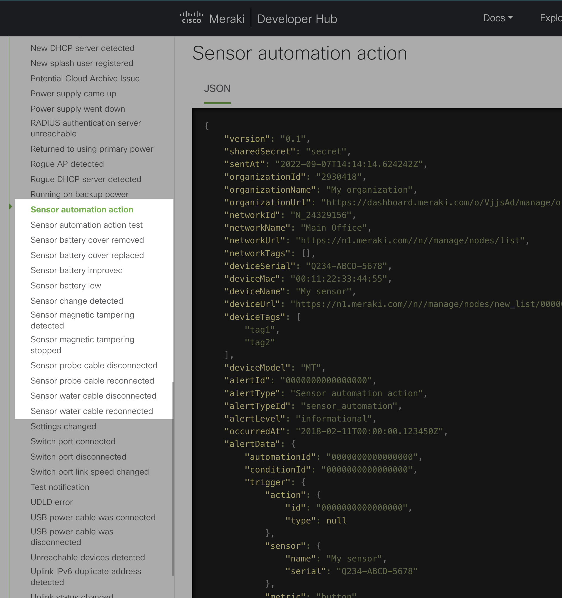
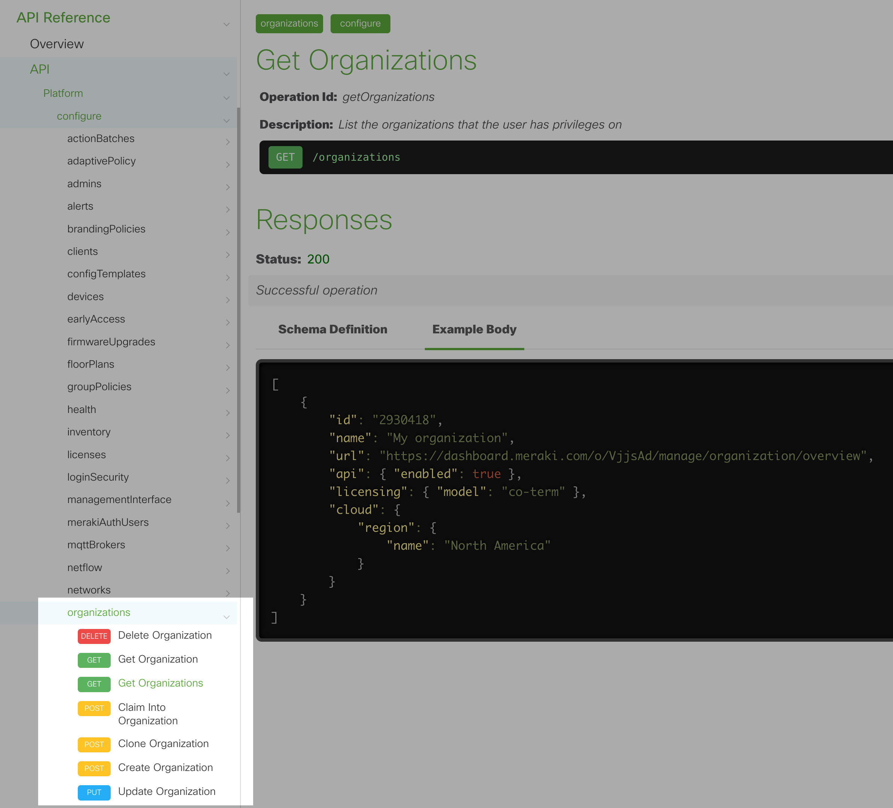
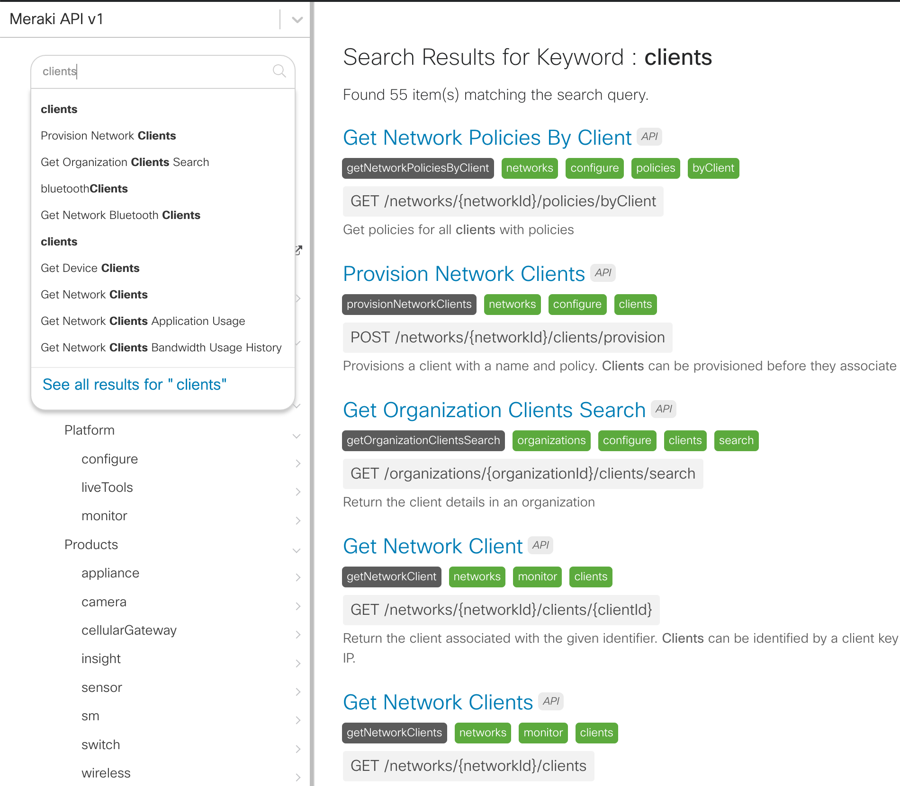
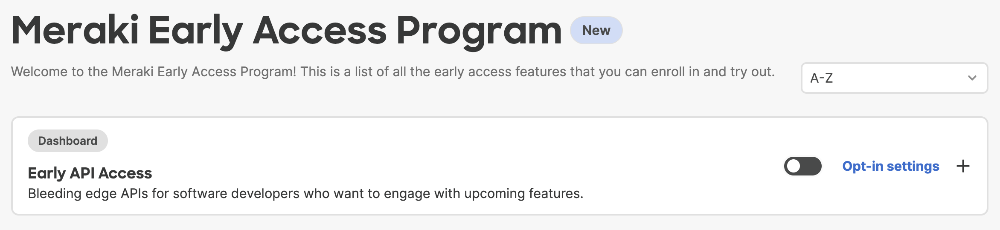
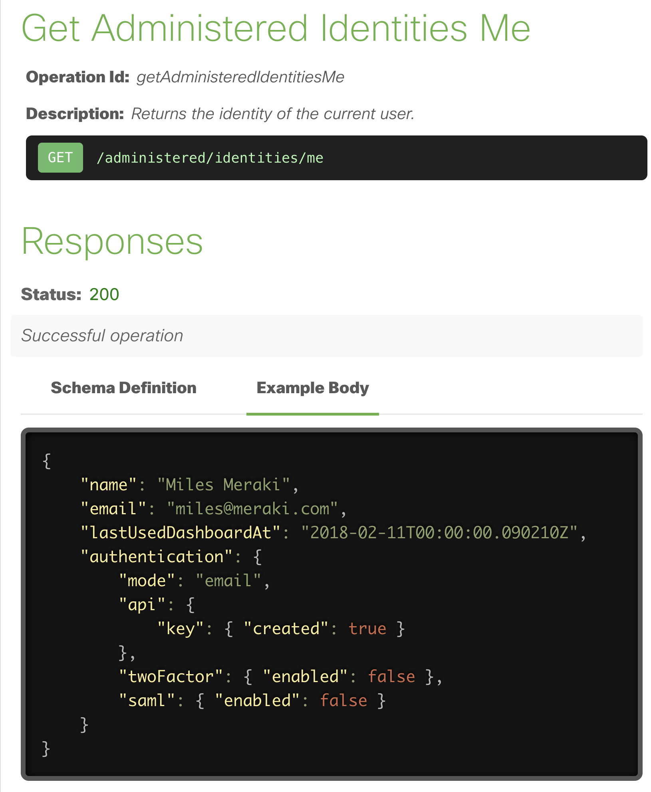
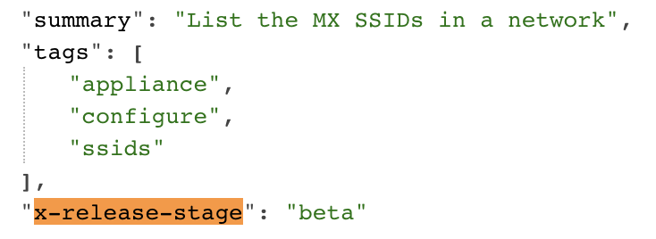
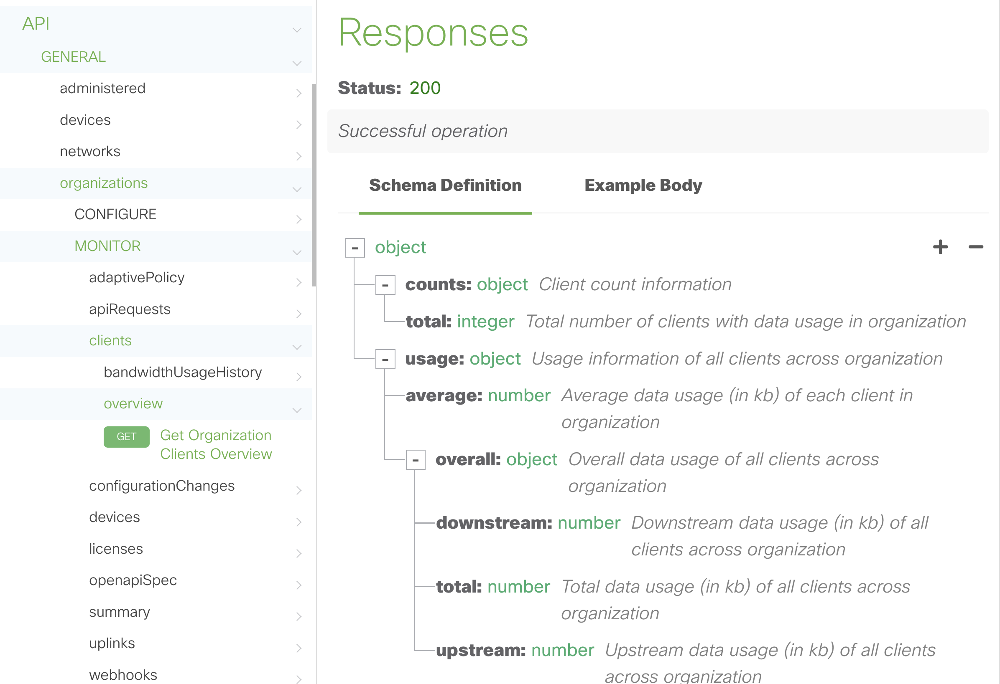

# 11-2022

## Highlights

The Webhook Template Editor is now available to our Early API Access users. With this new editor included in the Meraki Dashboard, you can easily manage, extend and create webhook templates. 
- [Documentation](https://developer.cisco.com/meraki/webhooks/#!webhook-payload-templates-getting-started/webhook-template-editor)
- [Early Access Post](https://community.meraki.com/t5/API-Early-Access-Announcements/Now-in-beta-Webhook-Payload-Template-Editor-Dashboard-GUI-page/ba-p/171360)

The DataDog webhook template has been updated to support new features and a nicer layout.
- [Documentation](https://developer.cisco.com/meraki/webhooks/#!datadog-custom/datadog)
- [Video Presentation](https://www.youtube.com/watch?v=YJHOKMcgNcg)

Webhook HTTPS Receiver limit has increased from 10 to 100 configured servers per network!
- [API Endpoint](https://developer.cisco.com/meraki/api-v1/#!get-network-webhooks-http-servers)

## Dashboard API Version 1.27.0 Released
[**Changelog**](##!v1-27-0)

### What’s New

[cellular](https://developer.cisco.com/meraki/api-v1/#!get-device-cellular-sims)
- Return the SIM and APN configurations for a cellular device.
- Updates the SIM and APN configurations for a cellular device.

[sensor](https://developer.cisco.com/meraki/api-v1/#!get-network-sensor-alerts-current-overview-by-metric)
- Return an overview of alert occurrences over a timespan, by metric

[policyObjects](https://developer.cisco.com/meraki/api-v1/#!get-organization-policy-objects)
- Lists Policy Objects belonging to the organization.
- Creates a new Policy Object.
- Lists Policy Object Groups belonging to the organization.
- Creates a new Policy Object Group.
- Shows details of a Policy Object Group.
- Updates a Policy Object Group.
- Deletes a Policy Object Group.
- Shows details of a Policy Object.
- Updates a Policy Object.
- Deletes a Policy Object.

[inventory](https://developer.cisco.com/meraki/api-v1/#!get-organization-inventory-onboarding-cloud-monitoring-imports)
- Check the status of a committed Import operation
- Commits the import operation to complete the onboarding of a device into Dashboard for monitoring.
- Initiates or updates an import session. An import ID will be generated and used when you are ready to commit the import.

[firmware](https://developer.cisco.com/meraki/api-v1/#!get-organization-firmware-upgrades-by-device)
- Get firmware upgrade status for the filtered devices

# 10-2022

## Highlights

#### Webhooks

- Added "ServiceNow" included payload template. [Webhook Docs](https://developer.cisco.com/meraki/build/servicenow/#!getting-started/configure-incident-creation)
- Updated DataDog custom template. [Webhook Docs](https://developer.cisco.com/meraki/webhooks/#!datadog-custom)
- You can now have up to 100 configured `httpServers`, a 10x increase! [API Doc](https://developer.cisco.com/meraki/api-v1/#!get-network-http-servers)

## Dashboard API Version 1.26.0 Released
[**Changelog**](##!v1-26-0)

### What's New

#### Platform
+ [ Firmware Upgrades ](https://developer.cisco.com/meraki/api-v1/#!get-network-firmware-upgrades)
  - Several new endpoints available to manage firmware upgrades, rollbacks and staging. 

#### Sensor
+ [Alerts byMetric](https://developer.cisco.com/meraki/api-v1/#!get-network-sensor-alerts-current-overview-by-metric)
  - Return an overview of currently alerting sensors by metric

#### Appliance 
+ [Extended IPv6 support](https://developer.cisco.com/meraki/api-v1/#!get-network-appliance-prefixes-delegated-statics)
  - prefixes
   
+ [uplinks](https://developer.cisco.com/meraki/api-v1/#!get-device-appliance-uplinks-settings)
  - Return the uplink settings for an MX appliance
  - Update the uplink settings for an MX appliance

+ [firewall](https://developer.cisco.com/meraki/api-v1/#!get-network-appliance-firewall-inbound-cellular-firewall-rules)
  - Return the inbound cellular firewall rules for an MX network
  - Update the inbound cellular firewall rules of an MX network

# 9-2022

## Highlights

**Documentation Enhancements**

- Webhook Alerts for MT Sensors are now [documented](https://developer.cisco.com/meraki/webhooks/#!webhook-sample-alerts/sensor-automation-action) and viewable in the [API](https://developer.cisco.com/meraki/api-v1/#!get-organization-webhooks-alert-types)

## Dashboard API Version 1.25.0 Released
[**Changelog**](##!v1-25-0)

### What's New

#### Platform
  + Early Access
    - [Returns list of enabled early access features for the identity](https://developer.cisco.com/meraki/api-v1/#!get-administered-identities-me-early-access-features-opt-ins).
    
  + Firmware
    - [Get firmware upgrade information for an organization](https://developer.cisco.com/meraki/api-v1/#!get-organization-firmware-upgrades)

#### Appliance
  + SSIDs
    - [SSID management for MXw appliances](https://developer.cisco.com/meraki/api-v1/#!get-network-appliance-ssids) !

# 8-2022

## Highlights

**Documentation Enhancements**

- The API Reference section has been adjusted to enable easier discovery of API operations without being concerned with the `organizations`, `networks` or `devices` scope. These core operations along with all other non product specific ones will now live under the **Platform** folder. 

 
  

- The **search** capability has been super charged. You can now search for all key information of an API operation and get a detailed listing of related APIs and docs. The search even supports filtering by prefixing your query with `api:` or `doc:`

  

- **Early API Access** is now publically available to opt-in via the Dashboard. To enable our early adopters to test and provide feedback, a new [Early Access section](https://developer.cisco.com/meraki/api-v1/#!api-reference-early-access-overview/early-api-access) of the API docs will include a listing of all new and updated endpoints. 
  

  

## Dashboard API Version 1.24.0 Released
[**Changelog**](##!v1-24-0)

### What's New

#### Switch
  + ports
    - [Switch Port Profiles](https://developer.cisco.com/meraki/api-v1/#!get-network-switch-ports-profiles)

#### Networks
  + alerts
    - [Alert History](https://developer.cisco.com/meraki/api-v1/#!get-network-alerts-history)

#### Appliance
  + firewall
    - [Settings](https://developer.cisco.com/meraki/api-v1/#!get-network-appliance-firewall-settings) (spoofing protection)

#### Organizations
  + devices
    - [Power Module Status](https://developer.cisco.com/meraki/api-v1/#!get-organization-devices-power-modules-statuses-by-device)
    - [Uplink Addresses](https://developer.cisco.com/meraki/api-v1/#!get-organization-devices-uplinks-addresses-by-device)

#### Sensor
  + alerts
    - [Alert Profiles](https://developer.cisco.com/meraki/api-v1/#!get-network-sensor-alerts-profile)

### What's Updated

#### Switch

**List the switch ports for a switch**

GET _`/devices/{serial}/switch/ports`_

> \- Response property `properties` value added

> \- Response property `allowedVlans` value added

> \- Response property `accessPolicyNumber` value added

> \- Response property `macAllowList` value added

> \- Response property `flexibleStackingEnabled` value added

#### Wireless

**Modify the splash page settings for the given SSID**

PUT _`/networks/{networkId}/wireless/ssids/{number}/splash/settings`_

> \- Optional property `selfRegistration` Added

# 7-2022

## Highlights

**Me**

Do you ever wonder who you are when developing an application? Now you can easily get the name, email and other details of the account bound to the API key currently in use.

[API Docs]((https://developer.cisco.com/meraki/api-v1/#!get-administered-identities-me))

**Early API Access** 

Added `"x-release-stage": "beta"` to all beta operations and properties that are available for Early API Access users. 
This is available in the [v1 beta branch](https://github.com/meraki/openapi/blob/v1-beta/openapi/spec2.json) of the Meraki OpenAPI specification. 

Documentation, SDKs and other tooling can now take advantage of this information to highlight features that are in development.

**API Response Schemas**

We are excited to begin including API response schemas in the OpenAPI specification and documentation. In addition, over 1/3 of all existing endpoints have recently been updated to include schemas with more to come.  

**Webhooks**

With the launch of [webhook integrations](https://blogs.cisco.com/developer/merakiwebhooks01), there have been a number of new solutions that have been made possible such as IT notification bots, provisioning workflows and custom security requirements for inbound API calls.

We are also happy to announce two new integrations, that were contributed by our community, for all to use as custom payload templates! 
- [Discord](https://github.com/meraki/webhook-payload-templates/tree/main/discord)
- [AlertMagic](https://github.com/meraki/webhook-payload-templates/tree/main/alertmagic)

## Dashboard API Version 1.23.0 Released

[**Changelog**](##!v1-23-0)

Version **1.22.0** _to_ **1.23.0**

* * *

**Summary of Changes**

**6 - New**

**125 - Updated**

**551 - Total Endpoints**

**348 - Total Paths**

### What's New
  * [ sm ]
    + trustedAccessConfigs
      - [List Trusted Access Configs](https://developer.cisco.com/meraki/api-v1/#!get-network-sm-trusted-access-configs)
  * [ organizations ]
    + devices
      - [List the availability information for devices in an organization. The data returned by this endpoint is updated every 5 minutes.](https://developer.cisco.com/meraki/api-v1/#!get-organization-devices-availabilities)
    + earlyAccess
      - [List the available early access features for organization](https://developer.cisco.com/meraki/api-v1/#!get-organization-early-access-features)
      - [List the early access feature opt-ins for an organization](https://developer.cisco.com/meraki/api-v1/#!get-organization-early-access-features-opt-ins)
      - [Create a new early access feature opt-in for an organization](https://developer.cisco.com/meraki/api-v1/#!create-organization-early-access-features-opt-in)
      - [Show an early access feature opt-in for an organization](https://developer.cisco.com/meraki/api-v1/#!get-organization-early-access-features-opt-in)
      - [Update an early access feature opt-in for an organization](https://developer.cisco.com/meraki/api-v1/#!update-organization-early-access-features-opt-in)
      - [Delete an early access feature opt-in](https://developer.cisco.com/meraki/api-v1/#!delete-organization-early-access-features-opt-in)
  * [ administered ]
    + identities
      - [Returns the identity of the current user.](https://developer.cisco.com/meraki/api-v1/#!get-administered-identities-me)

### What's Updated

* **125** Operations updated with schemas or more information!

# 6-2022

## Dashboard API Version 1.22.0 Released

[**Changelog**](##!v1-22-0)

### Highlights

- What’s New
  * [ switch ]
    + dhcpServerPolicy
      - Return the list of servers trusted by Dynamic ARP Inspection on this network. These are also known as whitelisted snoop entries
      - Add a server to be trusted by Dynamic ARP Inspection on this network
      - Update a server that is trusted by Dynamic ARP Inspection on this network
      - Remove a server from being trusted by Dynamic ARP Inspection on this network
      - Return the devices that have a Dynamic ARP Inspection warning and their warnings
    + dhcp
      - Return the network’s DHCPv4 servers seen within the selected timeframe (default 1 day)

  * [ networks ]
    + policies
      - Get policies for all clients with policies

- What's Updated
  * [ switch ]
    + accessPolicies
      - Optional property `failedAuthVlanId` Added
      - Optional property `reAuthenticationInterval` Added
    + dhcpServerPolicy
      - Optional property `alerts` Added
      - Optional property `arpInspection` Added
  * [ wireless ]
    + rfProfiles
      - Optional property `transmission` Added

  * [ organizations ]
    + apiRequests
      - Optional param `version` added
      - Optional param `operationIds` added
      - Optional property `version` Added
      - Optional property `operationId` Added
      - Response property `version` value added
      - Response property `operationId` value added

### What's New

# 5-2022

## Dashboard API Version 1.21.0 Released

[**Changelog**](##!v1-21-0)

### Highlights

- What's New
  * [ switch ]
    + ports
      - List the switchports in an organization by switch

- What's Updated
  * [ organizations ]
    + network settings
      - Response property `isBoundToConfigTemplate` value added
    + brandingPolicies
      - Response property `customLogo` value added
    + apiRequests
      - Optional param `userAgent` added
    
      

# 4-2022

## Dashboard API Version 1.20.0 Released

[**Changelog**](##!v1-20-0)

### Highlights

- What's New

  * [ appliance ]
    + vmx
      Generate a new vMX authentication token
  * [ camera ]
    + customAnalytics
      - Return custom analytics settings for a camera
      - Update custom analytics settings for a camera
      - List Custom Analytics Artifacts
      - Create custom analytics artifact. Returns an artifact upload URL with expiry time. Upload the artifact file with a put request to the returned upload URL before its expiry.
      - Get Custom Analytics Artifact
      - Delete Custom Analytics Artifact

- What's Updated

  * [ switch ]

    -	Switch ports statuses endpoint now has an isUplink boolean value
    -	Switch DHCP server policy endpoint now offers additional information/config options for things like alerts/arp inspection
    -	Switch access policy now enabled dot1X control direction config
    - 	Switch port config endpoint now lists the link negotiation capabilities for that port

  * [ network ]
    -	Firmware upgrades and rollbacks endpoints now list release dates for the software

# 3-2022

## Dashboard API Version 1.19.0 Released

[**Changelog**](##!v1-19-0)

### Highlights

- What's New

  * [ organizations ]
    + inventory
      - Claim a list of devices, licenses, and/or orders into an organization. When claiming by order, all devices and licenses in the order will be claimed; licenses will be added to the organization and devices will be placed in the organization's inventory. Use /organizations/{organizationId}/inventory/release to release devices from an organization.
      - Release a list of claimed devices from an organization.
  * [ sensor ]
    + readings
      - Return all reported readings from sensors in a given timespan, sorted by timestamp
      - Return the latest available reading for each metric from each sensor, sorted by sensor serial

- What's Updated

  * [ wireless ]
    + rfProfiles
      - Optional property `perSsidSettings` Added
  * [ ssids ]
    + Update the attributes of an MR SSID
      - Optional property `secondaryConcentratorNetworkId` Added
      - Optional property `disassociateClientsOnVpnFailover` Added
      - Optional property `speedBurst` Added
  * [ organizations ]
    + adaptivePolicy
      - Response property `isDefaultGroup` value added
      - Response property `requiredIpMappings` value added
    + loginSecurity 
      - Limit API access based on IP address
    + service
      - Obtain the cloud region details for the organization

## ServiceNow SG Connector for Meraki - San Diego Certified

The connector has been validated for the latest ServiceNow version.

[Store Link](https://store.servicenow.com/sn_appstore_store.do#!/store/application/dc27a74a80421010f8772cdfe9d5f855)

# 2-2022

## Dashboard API Version 0 Sunset

> <h1 style="color:red;">SUNSET NOTICE</h1>
> <strong>Dashboard API v0 has reached its end-of-support</strong>
> 
> Please use [Dashboard API v1](https://developer.cisco.com/meraki/api-v1/) and take advantage of the many new enhancements.
> 
> You can read more about this in our [Community post](https://community.meraki.com/t5/Developers-APIs/Dashboard-API-v0-End-of-Support-Sunset-amp-Grace-Period/m-p/138696).

## Dashboard API Version 1.18.0 Released

[**Changelog**](##!v1-18-0)

### Highlights

- What's New
  * [networks]
    + webhooks
      - List the webhook payload templates for a network
      - Create a webhook payload template for a network
      - Get the webhook payload template for a network
      - Update a webhook payload template for a network
      - Destroy a webhook payload template for a network.

- What's Updated
  * [networks]
    + webhooks
      - Add an HTTP server to a network (with a webhook payload template)
      - Send a test webhook for a network (with a webhook payload template)
  * [wireless]
    + ssids
      - List the VPN settings for the SSID.
      - Update the VPN settings for the SSID
  * [organizations]
    + webhooks
      - Return a list of alert types to be used with managing webhook alerts
    + devices
      - List the status of every Meraki device in the organization
    + service
      - List the organizations that the user has privileges on
      - Return an organization
        - Optional property `licensing` Added
        - Response property `licensing` value added

# 1-2022

## Dashboard API Version 1.17.0 Released

[**Changelog**](##!v1-17-0)

### Highlights

[ switch ]

- Response property `ipv6` value added to routing interfaces

[ organizations ]

**adaptivePolicy**
- List adaptive policy groups in a organization
- Creates a new adaptive policy group
- Returns an adaptive policy group
- Updates an adaptive policy group. 
- Deletes the specified adaptive policy group and any associated policies and references
- Returns adaptive policy aggregate statistics for an organization
- List adaptive policies in an organization
- Add an Adaptive Policy
- Return an adaptive policy
- Update an Adaptive Policy
- Delete an Adaptive Policy