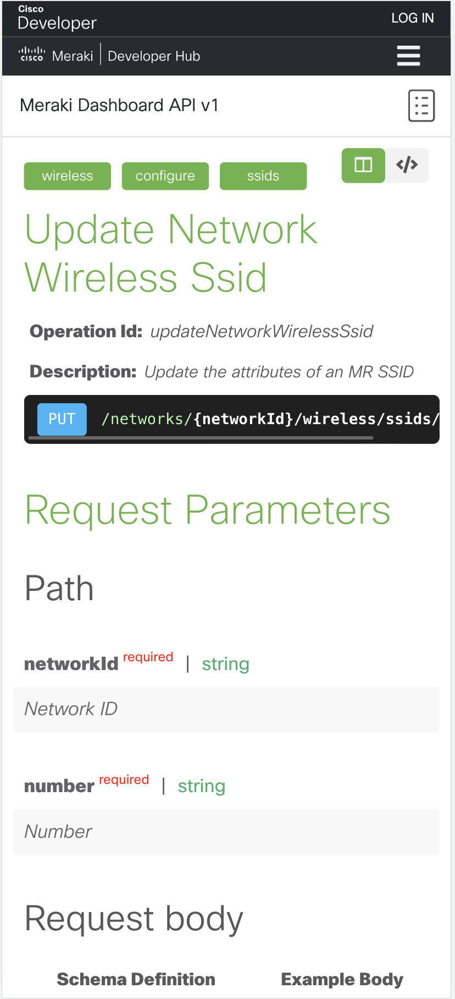
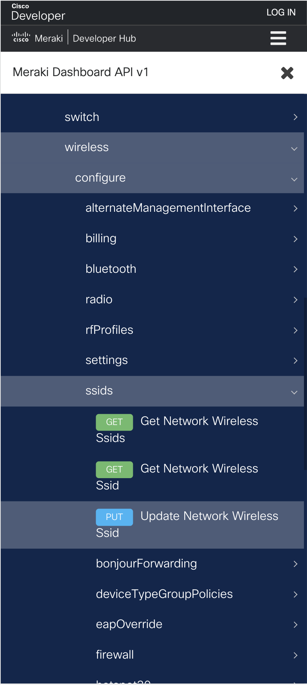

# 7-2023

## Highlights

API Docs are now mobile friendly!

<table>
<th>

</th>
<th>

</th>
</table>
## Dashboard API Version 1.35.0 Released

[**Changelog**](##!v1-35-0)

### Summary of Changes

1 - New

22 - Updated

631 - Total Endpoints

398 - Total Paths

---

## What's New

### Appliance

#### Uplinks

**[Get the sent and received bytes for each uplink of all MX and Z networks within an organization. If more than one device was active during the specified timespan, then the sent and received bytes will be aggregated by interface.](https://developer.cisco.com/meraki/api-v1/#!get-organization-appliance-uplink-statuses)**

- `GET /organizations/{organizationId}/appliance/uplinks/usage/byNetwork`
- Get the sent and received bytes for each uplink of all MX and Z networks within an organization. If more than one device was active during the specified timespan, then the sent and received bytes will be aggregated by interface.

## What's Updated

### Wireless
- **RF Profiles**
  - Creates new RF profile for this network: Added optional property `flexRadios`
  - Updates specified RF profile for this network: Added optional property `flexRadios`
- **SSIDs**
  - List the Bonjour forwarding setting and rules for the SSID: Added response property `exception`
  - Update the Bonjour forwarding setting and rules for the SSID: Added optional property `exception`

### Networks
- **Alerts**
  - Update the alert configuration for this network: Added optional property `muting`
- **Floor Plans**
  - List the floor plans that belong to your network: Added response property `productType`
  - Find a floor plan by ID: Added response property `productType`

### Organizations
- **Devices**
  - List the status of every Meraki device in the organization: Added response property `items`

## Added Response Schemas
These endpoints have expanded the information that the API returns, providing a more comprehensive view of each resource.

### Wireless
- **Status**
  - Return the SSID statuses of an access point
- **Billing**
  - Return the billing settings of this network
- **SSIDs**
  - List the MR SSIDs in a network
  - Return a single MR SSID
### Networks
- **Floor Plans**
  - List the floor plans that belong to your network
  - Find a floor plan by ID
### Organizations
- **ConfigTemplates**
  - List the configuration templates for this organization
  - Return a single configuration template

# 6-2023

## Highlights

- OpenAPI v3 is officially supported! [Read the blog post](https://community.meraki.com/t5/Developers-APIs/OpenAPI-v3-Officially-Supported/m-p/197649/highlight/true#M8394)
- The [Meraki ServiceGraph Connector](https://store.servicenow.com/sn_appstore_store.do#!/store/application/dc27a74a80421010f8772cdfe9d5f855/1.3.3) for ServiceNow **v1.3.3** has been released. This includes support for the Utah ServiceNow release. [Read the blog post](https://community.meraki.com/t5/Developers-APIs/ServiceGraph-Connector-for-Meraki-Utah-Certified-and-more/m-p/196546/highlight/true#M8303)

## Dashboard API Version 1.34.0 Released

[**Changelog**](##!v1-34-0)

## Summary of Changes

**7 - New**

**98 - Updated**

**631 - Total Endpoints**

**398 - Total Paths**

---

## What's New

### Appliance

#### RF Profiles

**[List the RF profiles for this network](https://developer.cisco.com/meraki/api-v1/#!get-network-appliance-rf-profiles)**

- `GET /networks/{networkId}/appliance/rfProfiles`

**[Creates new RF profile for this network](https://developer.cisco.com/meraki/api-v1/#!create-network-appliance-rf-profile)**

- `POST /networks/{networkId}/appliance/rfProfiles`

**[Return a RF profile](https://developer.cisco.com/meraki/api-v1/#!get-network-appliance-rf-profile)**

- `GET /networks/{networkId}/appliance/rfProfiles/{rfProfileId}`

**[Updates specified RF profile for this network](https://developer.cisco.com/meraki/api-v1/#!update-network-appliance-rf-profile)**

- `PUT /networks/{networkId}/appliance/rfProfiles/{rfProfileId}`

**[Delete a RF Profile](https://developer.cisco.com/meraki/api-v1/#!delete-network-appliance-rf-profile)**

- `DELETE /networks/{networkId}/appliance/rfProfiles/{rfProfileId}`

#### Radio

**[Return the radio settings of an appliance](https://developer.cisco.com/meraki/api-v1/#!get-device-appliance-radio-settings)**

- `GET /devices/{serial}/appliance/radio/settings`

**[Update the radio settings of an appliance](https://developer.cisco.com/meraki/api-v1/#!update-device-appliance-radio-settings)**

- `PUT /devices/{serial}/appliance/radio/settings`

### Wireless

#### Devices

**[Get average channel utilization for all bands in a network, split by AP](https://developer.cisco.com/meraki/api-v1/#!get-organization-wireless-devices-channel-utilization-by-device)**

- `GET /organizations/{organizationId}/wireless/devices/channelUtilization/byDevice`

**[Get average channel utilization across all bands for all networks in the organization](https://developer.cisco.com/meraki/api-v1/#!get-organization-wireless-devices-channel-utilization-by-network)**

- `GET /organizations/{organizationId}/wireless/devices/channelUtilization/byNetwork`

**[Get a time-series of average channel utilization for all bands, segmented by device](https://developer.cisco.com/meraki/api-v1/#!get-organization-wireless-devices-channel-utilization-history-by-device-by-interval)**

- `GET /organizations/{organizationId}/wireless/devices/channelUtilization/history/byDevice/byInterval`

**[Get a time-series of average channel utilization for all bands](https://developer.cisco.com/meraki/api-v1/#!get-organization-wireless-devices-channel-utilization-history-by-network-by-interval)**

- `GET /organizations/{organizationId}/wireless/devices/channelUtilization/history/byNetwork/byInterval`

## What's Updated

### Appliance

#### Firewall

**Return the L7 firewall application categories and their associated applications for an MX network**

- Response schema has been added to provide detailed output.

#### SSIDs

**Update the attributes of an MX SSID**

- A new optional property `dot11w` has been introduced.

### Networks

#### Firmware Upgrades

**Get firmware upgrade information for a network, Update firmware upgrade information for a network, Create a Staged Upgrade Event for a network**

- Various new optional properties like `cloudGateway` and `switchCatalyst` have been added.
- Response schemas have been added to provide detailed output.

#### Topology

**List the LLDP and CDP information for all discovered devices and connections in a network**

- Added response schema to provide error details.

#### Clients

**List the clients that have used this network in the timespan**

- New optional param `pskGroup` and property `pskGroup` have been added.
- Response schema has been added for `pskGroup`.

### SM

#### Trusted Access Configs

**List Trusted Access Configs**

- New optional properties `sendExpirationEmails`, `notifyTimeBeforeAccessEnds`, and `additionalEmailText` have been added.
- Response schemas for the new optional properties have been introduced.

### Switch

#### DSCP to CoS Mappings, Quality of Service Rule, Multicast Settings, DHCP Server Settings, and many more

- Response schemas have been added to these services for a more detailed output.

### Wireless

#### RF Profiles

**List RF profiles for this network, Return a RF profile, Updates specified RF profile for this network, Creates new RF profile for this network**

- Response schemas have been added.
- The optional property `sixGhzSettings` has been introduced.

### Organizations

#### Admins, API Requests, SAML Roles, and many more

**List the dashboard administrators in this organization, Return an aggregated overview of API requests data, List the SAML roles for this organization, Return a SAML role**

- Response schemas have been added to provide detailed output.

#### OpenAPI Spec

**Return the OpenAPI Specification of the organization's API documentation in JSON**

- New optional param `version` added, which now allows returning an OpenAPI v3 specification by setting its value to `3`. The summary of the operation has also been updated accordingly.

# 5-2023

## Highlights

- Dashboard API Python Library v1.33.0 released. Read more about it in our [community post.](https://community.meraki.com/t5/Developers-APIs/Dashboard-API-Python-Library-v1-33-0-1%EF%B8%8F%E2%83%A3-%EF%B8%8F3%EF%B8%8F%E2%83%A33%EF%B8%8F%E2%83%A3-%EF%B8%8F0%EF%B8%8F%E2%83%A3/m-p/193564/highlight/true#M8163)
- The [Meraki Servicegraph Connector](https://store.servicenow.com/sn_appstore_store.do#!/store/application/dc27a74a80421010f8772cdfe9d5f855/1.3.2) for ServiceNow **v1.3.2** has been released. This includes a Bug fix to address challenges some users were experiencing while importing devices.

## Dashboard API Version 1.33.0 Released

[**Changelog**](##!v1-33-0)

## Summary of Changes

**3 - New**

**858 - Updated**

**620 - Total Endpoints**

**391 - Total Paths**

---

## What's Updated

### [appliance]

#### vpn

**Update a Hub BGP Configuration**

- Description added: `Network ID`
- Optional property `sourceInterface` Added
- Optional property `nextHopIp` Added
- Optional property `ttlSecurity` Added
- Optional property `authentication` Added

### [networks]

#### webhooks

**List the webhook payload templates for a network**

- Description added: `Network ID`
- Optional property `sharing` Added
- Response property `sharing` value added

**Get the webhook payload template for a network**

- Description added: `Network ID`
- Description added: `Payload template ID`
- Optional property `sharing` Added
- Response property `sharing` value added

**Update a webhook payload template for a network**

- Description added: `Network ID`
- Description added: `Payload template ID`
- Optional property `sharing` Added

**Create a webhook payload template for a network**

- Description added: `Network ID`
- Optional property `sharing` Added

### [organization]

#### adaptivePolicy

**List adaptive policy ACLs in a organization**

- Description added: `Organization ID`
- Response property `properties` value added

**Returns the adaptive policy ACL information**

- Description added: `Organization ID`
- Description added: `Acl ID`
- Response property `properties` value added

#### earlyAccess

**List the available early access features for organization**

- Description added: `Organization ID`
- Response property `properties` value added
- Response property `supportLink` value added

### [wireless]

#### ssids

**List all Identity PSKs in a wireless network**

- Description added: `Network ID`
- Description added: `Number`
- Response property `format` value added

**Return an Identity PSK**

- Description added: `Network ID`
- Description added: `Number`
- Description added: `Identity psk ID`
- Response property `format` value added

**Update an Identity PSK**

- Description added: `Network ID`
- Description added: `Number`
- Description added: `Identity psk ID`
- Optional property `expiresAt` Added

**Create an Identity PSK**

- Description added: `Network ID`
- Description added: `Number`
- Optional property `expiresAt` Added

**Other updated Endpoints**

In addition to the above mentioned updates, many existing endpoints have been updated with new description properties. To get a detailed list of what description properties are added to each endpoints please refer [What's updated section](https://developer.cisco.com/meraki/whats-new/#!v1-33-0/whats-updated) of the API documentation.

---

## What's New

### [sensor]

#### mqttBrokers

**List the sensor settings of all MQTT brokers for this network. To get the brokers themselves, use /networks/{networkId}/mqttBrokers.**

- New path added: `/networks/{networkId}/sensor/mqttBrokers`
- New endpoint: `GET /networks/{networkId}/sensor/mqttBrokers`

**Return the sensor settings of an MQTT broker. To get the broker itself, use /networks/{networkId}/mqttBrokers/{mqttBrokerId}.**

- New path added: `/networks/{networkId}/sensor/mqttBrokers/{mqttBrokerId}`
- New endpoint: `GET /networks/{networkId}/sensor/mqttBrokers/{mqttBrokerId}`

**Update the sensor settings of an MQTT broker. To update the broker itself, use /networks/{networkId}/mqttBrokers/{mqttBrokerId}.**

- New endpoint: `PUT /networks/{networkId}/sensor/mqttBrokers/{mqttBrokerId}`

### [organizations]

#### devices

**List the provisioning statuses information for devices in an organization.**

- New path added: `/organizations/{organizationId}/devices/provisioning/statuses`
- New endpoint: `GET /organizations/{organizationId}/devices/provisioning/statuses`

---

# 4-2023

## Dashboard API Version 1.32.0 Released

[**Changelog**](##!v1-32-0)

## Summary of Changes

**1 - New**

**16 - Updated**

**616 - Total Endpoints**

**388 - Total Paths**

---

## What's Updated

### [switch]

#### routing

**Return a layer 3 static route for a switch**

- Added response schema.

#### accessPolicies

**List the access policies for a switch network**

- Added optional property `guestPortBouncing`.
- Added response property `guestPortBouncing` value.

**Return a specific access policy for a switch network**

- Added optional property `guestPortBouncing`.
- Added response property `guestPortBouncing` value.

**Create an access policy for a switch network**

- Added optional property `guestPortBouncing`.

**Update an access policy for a switch network**

- Added optional property `guestPortBouncing`.

#### mtu

**Return the MTU configuration**

- Added response schema.
- Added response property `switchProfiles` value.

### [appliance]

#### trafficShaping

**Returns the uplink bandwidth limits for your MX network**

- Deleted property `capabilities`.
- Changed summary from `Returns the uplink bandwidth settings for your MX network.` to `Returns the uplink bandwidth limits for your MX network`.

### [networks]

#### events

**List the events for the network**

- Added optional property `category`.
- Added response property `category` value.

### [organizations]

#### devices

**List the devices in an organization**

- Added response schema.

---

## What's New

### [organizations]

#### inventory

**Initiates or updates an import session. An import ID will be generated and used when you are ready to commit the import.**

- New path added: `/organizations/{organizationId}/inventory/onboarding/cloudMonitoring/prepare`
- New endpoint: `POST /organizations/{organizationId}/inventory/onboarding/cloudMonitoring/prepare`

---

# 3-2023

# Meraki Dashboard API v1 Release Notes

Version **v1.30.0** _to_ **v1.31.0**

## Summary of Changes

**2 - New**

**13 - Updated**

**615 - Total Endpoints**

**387 - Total Paths**

---

## What's Updated

### [organizations]

#### inventory

**Return the device inventory for an organization**

- Added optional property `orderNumbers`.

#### earlyAccess

**List the available early access features for organization**

- Added response property `documentationLink` value.

### [appliance]

#### trafficShaping

**Returns the uplink bandwidth settings for your MX network**

- Added response schema and property `capabilities` values.

### [sm]

#### profiles

**List all profiles in a network**

- Added response property `items` value.
- Changed summary from `List all the profiles in the network` to `List all profiles in a network`.

### [switch]

#### accessControlLists

**Return the access control lists for a MS network**

- Added response schema.

#### stacks

**Show a switch stack**

- Added response schema.

### [wireless]

#### ssids

**Return the EAP overridden parameters for an SSID**

- Added response properties `properties`, `timeout`, `maxRetries`, `identity`, and `eapolKey` values.

---

## What's New

### [organizations]

#### inventory

**Imports event logs related to the onboarding app into elastisearch**

- New path added: `/organizations/{organizationId}/inventory/onboarding/cloudMonitoring/exportEvents`
- New endpoint: `POST /organizations/{organizationId}/inventory/onboarding/cloudMonitoring/exportEvents`

**Returns list of networks eligible for adding cloud monitored device**

- New path added: `/organizations/{organizationId}/inventory/onboarding/cloudMonitoring/networks`
- New endpoint: `GET /organizations/{organizationId}/inventory/onboarding/cloudMonitoring/networks`

**Initiates or updates an import session. An import ID will be generated and used when you are ready to commit the import.**

- New path added: `/organizations/{organizationId}/inventory/onboarding/cloudMonitoring/prepare`
- New endpoint: `POST /organizations/{organizationId}/inventory/onboarding/cloudMonitoring/prepare`

---

# 2-2023

## Highlights

- The Meraki SGC for ServiceNow **v1.3** has been released. Read all about it on our API Community [here](https://community.meraki.com/t5/Developers-APIs/ServiceNow-ServiceGraph-Connector-for-Meraki-v1-3-Released/m-p/181468/highlight/true#M7381)

## Dashboard API Version 1.30.0 Released

[**Changelog**](##!v1-30-0)

### What's New?

#### Sensors

[List the sensor roles for a given sensor or camera device.](https://developer.cisco.com/meraki/api-v1/#!get-device-sensor-relationships)

#### Switch

[Added support for switch port profiles](https://developer.cisco.com/meraki/api-v1/#!get-organization-config-template-switch-profile-port)

#### Organization

[Tracks organizations' API requests by response code across a given time period](https://developer.cisco.com/meraki/api-v1/#!get-organization-api-requests-overview-response-codes-by-interval)

#### Wireless

[Endpoint to see power status for wireless devices](https://developer.cisco.com/meraki/api-v1/#!get-organization-wireless-devices-ethernet-statuses)